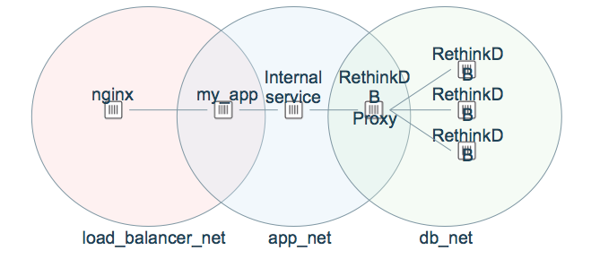
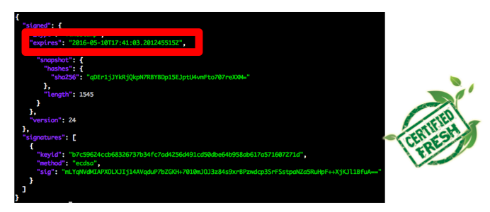
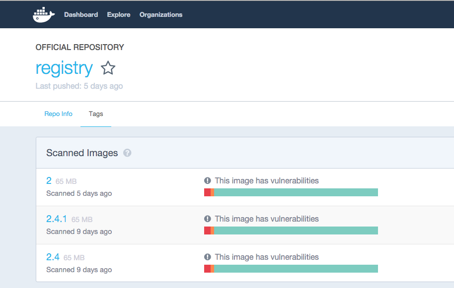

# Secure Image


---

## What is a layered filesystem?

WHAT IS IN AN IMAGE: = THE LAYERED FILESYSTEM

- Union filesystem
  - Combine multiple directories to look like a single filesystem
  - Tombstoning/whiteout files to delete files from lower layers

- Copy-on-write

Note:

Learn Docker layer filesystem
https://docs.docker.com/engine/userguide/storagedriver/imagesandcontainers/

Blog has video on Docker Storage
https://blog.docker.com/2015/10/docker-basics-webinar-qa/

---

## Supported Implementations

- Rocked Image Layers (R/O)

  - Aufs
  - Btrfs
  - OverlayFS
  - Devicemapper

- Container Layer
- Union Mount point


- Rocked Image Layers (R/O)

Note: Each Docker image references a list of read-only layers


---

## Copy-on-write
- The major difference between a container and an image is the top writable layer.
- Each containers get its own writable layers
- Reduces the amount of space consumed by containers
- Reduces the time required to start a container


Note:
All writes to the container that add new or modify existing data are stored in this writable layer. When the container is deleted the writable layer is also deleted. The underlying image remains unchanged.

Because each container has its own thin writable container layer, and all changes are stored in this container layer, this means that multiple containers can share access to the same underlying image and yet have their own data state. The diagram below shows multiple containers sharing the same Ubuntu 15.04 image.

- Sharing promotes smaller images
- Copying makes containers efficient
  - All writes made to a container are stored in the thin writable container layer. The other layers are read-only (RO) image layers and can’t be changed. This means that multiple containers can safely share a single underlying image.

  - Docker’s copy-on-write strategy not only reduces the amount of space consumed by containers, it also reduces the time required to start a container

---

## Best practice: *minimal* base images
### Do !!!

alpine 					
- ~ 2 MB from hub (1 layer!)
- musl libc and busybox
ubuntu 				
- ~ 50 MB from hub

---

## Best practice: verify content
### Do!!!
```
RUN apt-key adv \
      --keyserver hkp://keyserver.ubuntu.com:80 \
      --recv-keys BBEBDCB318AD50EC6865090613B00F1FD2C19886 \
    && echo deb http://repository.spotify.com stable non-free \
    | sudo tee /etc/apt/sources.list.d/spotify.list
```

Note:
Download gpg key from Ununtu to authenticate package for Spotify, store spotify Locations to fetch a package

 Output:
```
sudo apt-key adv \
> --keyserver hkp://keyserver.ubuntu.com:80 \
> --recv-keys BBEBDCB318AD50EC6865090613B00F1FD2C19886 \
> && echo deb http://repository.spotify.com stable non-free \
> | sudo tee /etc/apt/sources.list.d/spotify.list
Executing: gpg --ignore-time-conflict --no-options --no-default-keyring --homedir /tmp/tmp.3pCONPTxxp --no-auto-check-trustdb --trust-model always --keyring /etc/apt/trusted.gpg --primary-keyring /etc/apt/trusted.gpg --keyserver hkp://keyserver.ubuntu.com:80 --recv-keys BBEBDCB318AD50EC6865090613B00F1FD2C19886
gpg: requesting key D2C19886 from hkp server keyserver.ubuntu.com
gpg: key D2C19886: "Spotify Public Repository Signing Key <operations@spotify.com>" not changed
gpg: Total number processed: 1
gpg:              unchanged: 1
deb http://repository.spotify.com stable non-free
ubuntu@manager:~$ cat /etc/apt/sources.list.d/spotify.list
deb http://repository.spotify.com stable non-free
```
apt-key is used to manage the list of keys used by apt to authenticate
       packages. Packages which have been authenticated using these keys will
       be considered trusted.

app-get uses
/etc/apt/sources.list  
Locations to fetch packages from.


apt-key
Usage: apt-key [--keyring file] [command] [arguments]

Manage apt's list of trusted keys

  apt-key add <file>          - add the key contained in <file> ('-' for stdin)
  apt-key del <keyid>         - remove the key <keyid>
  apt-key export <keyid>      - output the key <keyid>
  apt-key exportall           - output all trusted keys
  apt-key update              - update keys using the keyring package
  apt-key net-update          - update keys using the network
  apt-key list                - list keys
  apt-key finger              - list fingerprints
  apt-key adv                 - pass advanced options to gpg (download key)


---

##Best practice: read only containers
### Do!!!
```
$ docker run it --rm --read-only alpine sh
```
Mounts the container’s FS as read-only

---

## Best practice: read-only Volumes
### Do!!!
```
-v /data:/data:ro
```

---

## Common mistake: mount host location as writable
### CAUTION!!!

```
$ docker run it --rm -v /:/host alpine sh
```

---

##Best practice: minimal, read-only mounts
```
$ docker run it --rm -v /subdir/we/need:/dir:ro alpine sh
```


---

# Networks

---

## Isolate services
Control which services can talk to which other services
- Easier to audit

---

## Links (legacy)
Allow 2 specific containers to talk to each other.
- Brittle: does not survive container restarts
```
docker run -d --name db mysql:latest
docker run -d --link db wordpress
```

---

## Network Namespace
```
docker network create my_app
docker run -it --rm --net=my_app alpine sh
```
Links are dynamic, can be created to not yet created containers.  

---

## Best practice: Use Multiple Networks


---

## Common Mistake: --net=host
Container can see
**ALL**
 network traffic, including traffic on docker virtual networks

---

## Common Mistake: ports exposed on host
* Unnecessary
* Creates conflicts

---

## Best practice: Mutual TLS
Implementation detail
: use mutual TLS between pairs of services that need to talk to each other.

---


#Image Distribution


---

## Security Goals
Image Provenance and Trust
- Provenance: who made this image?
  - Verify the publisher of the image
- Trust: have the contents of this image been tampered with?
  - Verify the integrity of the image

---

## Pulling by tag
```
$ docker pull alpine:latest
```
Name resolution takes place in registry to find content-address of image
```
$ docker pull alpine
```
Using default tag: latest
Notice that the tag defaults to
latest
  if no tags are given!

---

##Pulling by digest
```
$ docker pull alpine@sha256:ea0d1389812...
```
No name resolution!

- *Security best practice*:
 pulling by digest to enforce consistent and “immutable” pulls because of content-addressability

---

## Content Trust
```
$ export DOCKER_CONTENT_TRUST=1
$ docker pull alpine:latest
```
Pull (1 of 1): alpine:latest@sha256:ea0d1389

- Benefits of pull by digest with ease of pull by tag


---


---


---

## Content Trust (on push)
```
$ export DOCKER_CONTENT_TRUST=1
$ docker tag alpine:latest <user>/alpine:trust
$ docker push <user>/alpine:trust
```
Looks the same as a regular push by tag!


---

## Content Trust (it’s more than gpg)
The push refers to a repository [<user>/alpine]
```
77f08abee8bf: Pushed
trust: digest: sha256:d5de850d728... size: 1355
Signing and pushing trust metadata
Enter passphrase for root key with ID e83f424:

Enter passphrase for new repository key with ID f903fc9 (docker.io/<user>/alpine):
Repeat passphrase for new repository key with ID f903fc9 (docker.io/<user>/alpine):
Finished initializing "docker.io/<user>/alpine"
Successfully signed "docker.io/<user>/alpine":trust
```


---

## Content Trust (it is more than gpg)
```
$ cat ~/.docker/trust/tuf/docker.io/alpine/metadata/timestamp.json | jq
```


---

## Docker Content Trust / Notary Threat Model
- Key compromise?
  - We can recover!
- Replay attacks?
  - Not with our freshness guarantees!
- Untrusted registry?
  - No problem!  DCT/Notary do not root any trust in the underlying content store or transport
  - Use signed TUF metadata to retrieve trusted hashes of content
  - Don’t even need to trust Notary server after first pull - local metadata pins trust, tagging keys are kept client-side for signing

---

## Docker Pull
Only pull trusted images
Use official images when possible!



---

## Docker Security Scanning


https://hub.docker.com/r/library/alpine/tags/
- All official images on hub are scanned for vulnerabilities, lobby upstream for fixes!
- Can view scan results after logging into Docker Hub

---

## Docker Security Scanning


- Checks against CVE database for declared layers
- Also performs binary scan to pick up on
statically linked binaries
- Official repos have been scanned since Nov 2015, are rescanned often

---

# Hands-On Exercise
github.com/riyazdf/dockercon-workshop
- **trust** directory

---
