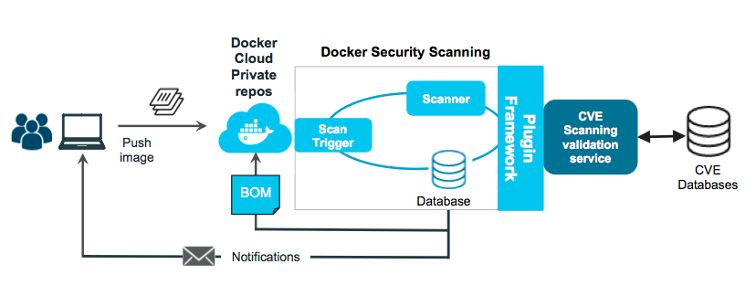
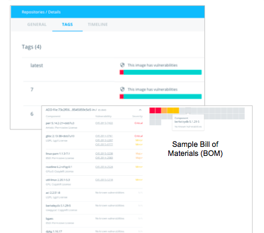
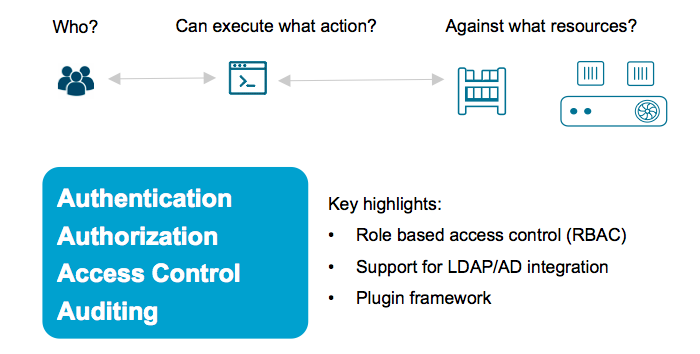
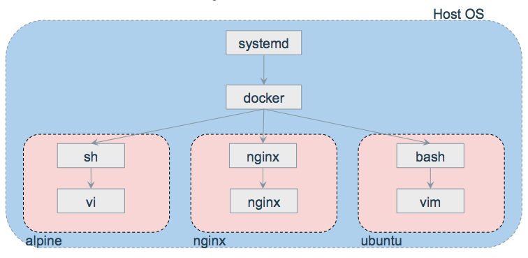

# Docker Security Workshop


Note:
This workshop is part of docker training add on module, security deep dive. This is one day workshop with lecture and labs.

---

## Agenda

- ####Introduction
- Overview of Docker Security
- Isolation: Kernel Namespaces and Control Groups
- User Management
- Secure Image
- Networks
- Image Distribution
- Capabilities
- Seccomp
- Linux Security Modules

---

# Introduction

---

## Course Objectives

####During this course, you will Learn

- Why Docker Platform is Secure
- The core technologies of Docker built-in default security
- How to deploy with add-on docker security features and tools
- What issues to consider when implementing Docker Security
- How to make docker contents secure
- How to make secure user management and access
- Learn Docker Security Best Practices

Note:
We will cover the followings;
- See how docker implements default security features
- what features and tools are available in Docker platform
- How do you use them?


---

## Logistics

- Course start and end times
- Breaks
- Lecture
- Lab Environments

---

## Introductions

- About your instructor
- About your
    - company and role?
    - Experience with Docker Security?
    - Expectations from this course?

---

## Agenda

- Introduction
- #### Overview of Docker Security
- Isolation: Kernel Namespaces and Control Groups
- User Management
- Secure Image
- Networks
- Image Distribution
- Capabilities
- Seccomp
- Linux Security Modules

---


# Overview of Docker Security

---

## Is Docker Container Secure?
- Is it safe to run applications in docker containers?
- Can one docker container break out and into another?
- What is inside my container?
- How do I know where this code came from?
- How do I keep our team safe from bad components?
- How do I stay on top of patches for compliance and governance?

Note: To answer these questions, we need to understand how docker is implemented.
Docker first started out as creating a runtime mechanism where containers could : application code can be contained in a container image and then run on a host. And that provided a useful ability to move things around, but : move things around and run them and get the code up and running and going. But the really interesting dynamics came when Docker became, in a sense, a package manager. And what I mean by a package manager was, there was ability to share containers, ability to build on top of containers, on top of other images, and to build workflows around sharing those containers.  When you apply the security lens to these containers and workflows, the following questions arise that must be addressed "Is Docker container secure to use?"

---

##  Docker aims to be Secure by Default

Common Vulnerabilities and Exposures(CVE) list that docker mitigated,  such that processes run in Docker containers were never vulnerable to the bug—even before it was fixed.

Feature lists are growing...

https://docs.docker.com/engine/security/non-events/

CVE-2013-1956, 1957, 1958, 1959, 1979, CVE-2014-4014, 5206, 5207, 7970, 7975, CVE-2015-2925, 8543, CVE-2016-3134, 3135, CVE-2014-0181, CVE-2015-3339, CVE-2014-4699, CVE-2014-9529, CVE-2015-3214, 4036, CVE-2016-0728, CVE-2016-2383

Note: This assumes containers are run without adding extra capabilities or not run as --privileged.


Bugs with security issue, note for upgrade or patch or downgrade.
CVE stands for:Common Vulnerabilities and Exposures
non-events: never vulnerable

Pointers for things that we are covering, seccomp, isolated name spaces, Docker protect you from nastiy security bugs

---


## Docker Security High-Level Overview


Note: There are 3 areas to focus, give secure platform and manage and package container images to be distributed iand provide secure access control to the running containers.


---

## Docker is additive to the security of your application ...

- the intrinsic security of the **kernel** and its support for **namespaces** and **cgroups**
- the attack surface of the Docker **daemon** itself
- loopholes in **the container configuration profile**, either by default, or when customized by users
- the _hardening_ **security features of the kernel** and how they interact with containers

Note: Docker containers are, by default, quite secure; especially if you take care of running your processes inside the containers as non-privileged users (i.e., non-root).

Control Groups, `cgroups` are a feature of the Linux kernel that allow you to limit the access processes and containers have to system resources such as CPU, RAM, IOPS and network.

`Namespaces` provide the first and most straightforward form of isolation: processes running within a container cannot see, and even less affect, processes running in another container, or in the host system.

Each container also gets its own `network stack`, meaning that a container doesn’t get privileged access to the sockets or interfaces of another container.

You can add an extra layer of safety by enabling AppArmor, SELinux, GRSEC, or your favorite hardening solution.

More details in this page: https://docs.docker.com/engine/security/security/

---

## Docker Secure Platform


Note: Linux Kernel isolation and docker default security setting and add-on Docker customizable profile settings will provide not only secure by default but also provide the additional customizable secure platform.

---

## Docker Secure Content management

Docker Security Scanning: Deep visibility with binary level scanning (Project Nautilus)
- Add-on service to Docker Cloud private repositories for Official Repositories located on Docker Hub
- Detailed bill of materials (BOM) of included components and vulnerability profile
- Checks packages against CVE database AND the code inside to protect against tampering

Proactive risk management
- Continuous monitoring of CVE/NVD databases with notifications pointing to repos and tags that contain new vulnerabilities

Secure the software supply chain
- Integrated workflow with  **Docker Content Trust**

Note:
 Docker Security Scanning, formerly known as Project Nautilus. Available today as an add-on service to Docker Cloud private repositories and for Official Repositories located on Docker Hub, Security Scanning provides a detailed security profile of your Docker images for proactive risk management and to streamline software compliance. Docker Security Scanning conducts binary level scanning of your images before they are deployed, provides a detailed bill of materials (BOM) that lists out all the layers and components, continuously monitors for new vulnerabilities, and provides notifications when new vulnerabilities are found.

---

## Docker Secure Content
### Image scanning and vulnerability detection(1/2)



Note:
Architectural diagram.

Security scanning is a service made up of a scan trigger which implements the APIs, the scanner, database, plugins.  The CVE scanning is a third party that plugs into our service that checks against the public CVE database.  So what happens?

A user/publisher pushes their image to their repo in Docker Cloud
The scan trigger kicks off the workflow by pulling the image from the repo, sending to the scanner service
The scanner service breaks up the image into layers and components then sends that to our validation service which checks each package against the CVE database and scans the binaries to make sure the contents of the packages are what they say they are.
Once complete, the data is sent back to security scanning and stored in our database as a JSON.  Those results per image are then sent back to Docker Cloud to be displayed in UI to the user.
If a new vulnerability is reported to the CVE database, a notification is sent to the security scanning service.  From there we check against our database and issue a notification to the account admin about the vulnerability and which repos and tags are affected.

Plugin framework - today we have one validation service connected but security scanning was designed in a way to easily add different validation services as needed

---
## Docker Secure Content

### Image scanning and vulnerability detection(2/2)



---
## Docker Content Trust

TODO: 

---

## Docker Secure Access



Note:

---

## Best way to Understand Security Features


- Knowing which tool to use
- Understand underlying implementation details
- Learn best practices
- Learn **Do!** and **Do Not!**

---

## Do! and Do Not!

|Do!|Do with Caution! | Do Not!        |
|-------|:---------------:|:---------------:|
|Approved features | Experimental features| Not Secure|


Note:
Do Not!
Docker Experimental features, do not!!! do with caution!!!
Examples: Don't mount all volumes
!(images/image19.png)  !(images/image20.png)

---

## How we talk about Docker


---

## How Docker Actually Works



---

## What kind of tools help to see how docker actually works?
```
top
htop
strace
journalctl
logs
```

---
