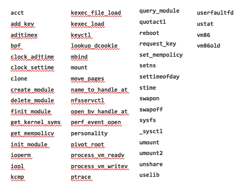
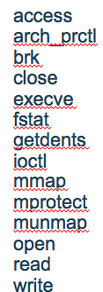
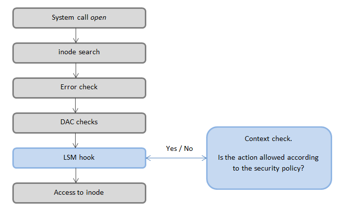

## Agenda

- Introduction
- Overview of Docker Security
- Isolation: Kernel Namespaces and Control Groups
- User Management
- Secure Image
- Networks
- Image Distribution
- ### Capabilities
- Seccomp
- Linux Security Modules

---

#Capabilities

---

##Root vs Not Root
Capabilities breakdown root permissions into groups that can be individually allowed or blocked
- Often don’t want or need all root permissions
- Can reduce attack surface by reducing capabilities

---

##Docker Default Capabilities
In whitelist:
```		
"CAP_CHOWN",
		"CAP_DAC_OVERRIDE",
		"CAP_FSETID",
		"CAP_FOWNER",
		"CAP_MKNOD",
		"CAP_NET_RAW",
		"CAP_SETGID",
		"CAP_SETUID",
		"CAP_SETFCAP",
		"CAP_SETPCAP",
		"CAP_NET_BIND_SERVICE",
		"CAP_SYS_CHROOT",
		"CAP_KILL",
		"CAP_AUDIT_WRITE",
```

---

##Docker Default Capabilities (Continued)
Not In whitelist:
```		
"CAP_AUDIT_CONTROL",	"CAP_AUDIT_READ",
"CAP_BLOCK_SUSPEND",	"CAP_DAC_READ_SEARCH",		
"CAP_IPC_LOCK",	"CAP_ICP_OWNER",		
"CAP_LEASE",		"CAP_LINUX_IMMUTABLE",		
"CAP_MAC_ADMIN",	"CAP_MAC_OVERRIDE",		
"CAP_NET_ADMIN",	"CAP_NET_BROADCAST",		
"CAP_SYS_ADMIN",	"CAP_SYS_BOOT",		
"CAP_SYS_MODULE",	"CAP_SYS_NICE",		
"CAP_SYS_PACCT",	"CAP_SYS_PTRACE",		
"CAP_SYS_RAWIO",	"CAP_SYS_RESOURCE",		
"CAP_SYS_TIME",	"CAP_SYS_TTY_CONFIG",		
"CAP_SYSLOG",		“CAP_WAKE_ALARM",
```

---

##How do we add/remove capabilities?
```
docker run --cap-add
docker run --cap-drop
docker run --cap-drop ALL --cap-add $CAP
```

---

##Configure capabilities in compose
cap_add:

  - CAP_NET_BROADCAST
  - CAP_NET_RAW


cap_drop:

  - ALL

---

##What to watch out for
Read the fine print for each capability!
- man capabilities
- i.e. removing
CAP_KILL
 only requires permissions checks and enabling bypasses permissions checks. It doesn’t generically enable/disable the ability to kill
- CAP_SYS_ADMIN
is nearly root...

---
##What to watch out for
```
$ man capabilities
```
---

##Capabilities and Docker
- No extended attributes in images -> no capabilities elevation normally possible

- Use docker to reduce capabilities
- Docker can’t grant capabilities to non-root users due to some limitations in older kernel versions

---

##Capabilities and Docker
Your options from worst to best:
1. Manual management within the container:
```
docker run --cap-add ALL
```
2. Restricted capabilities (still root):
```
docker run --cap-drop ALL --cap-add ABC
```
3. No capabilities:
```
docker run --user
```

---

##What to watch out for
$ docker run --privileged …
- gives *all capabilities* to the container, also lifts limitations from  *device* cgroup


---

##Hands-On Exercise
github.com/riyazdf/dockercon-workshop
- **capabilities** directory

---

## Agenda

- Introduction
- Overview of Docker Security
- Isolation: Kernel Namespaces and Control Groups
- User Management
- Secure Image
- Networks
- Image Distribution
- Seccomp
- Capabilities
- ####Seccomp
- Linux Security Modules

---

#Seccomp

---

##Original Seccomp
On-off feature that disabled all system calls except:
- exit()
- read()
- write()
- sigreturn()

---

##Seccomp-BPF
- Extension
- Allows us to configure what system calls are allowed/blocked
- Uses Berkeley Packet Filters (BPF)
- Allows examining system calls in detail before making a decision

---

##Is it enabled?
In the kernel:
```
$ grep SECCOMP /boot/config-$(uname -r) # or zgrep SECCOMP /proc/config.gz
CONFIG_SECCOMP=y
CONFIG_SECCOMP_FILTER=y
```
In docker:
```
$ docker run --rm alpine grep Seccomp /proc/self/status
```
In docker 1.12:
```
$ docker info
```

---

##Default Whitelist
Lots of system calls, what’s excluded:



---

##The strace tool
```
$ strace -c -f -S name ls 2>&1 1>/dev/null | tail -n +3 | head -n -2 | awk '{print $(NF)}'
```


---

##Docker seccomp profile DSL
Seccomp
 policy example:
```
{
     "defaultAction": "SCMP_ACT_ERRNO",
     "architectures": [
         "SCMP_ARCH_X86_64",
    	    "SCMP_ARCH_X86",
    	    "SCMP_ARCH_X32"
	],
	   "syscalls": [
    	{
        	"name": "accept",
        	"action": "SCMP_ACT_ALLOW",
        	"args": []
    	},
    	...
	]
}
```

Possible actions:
- SCMP_ACT_KILL
- SCMP_ACT_TRAP
- SCMP_ACT_ERRNO
- SCMP_ACT_TRACE
- SCMP_ACT_ALLOW

---

##Docker seccomp profile DSL
More complex filters:
```
"args": [
  {
      "index": 0,
      "op": "SCMP_CMP_MASKED_EQ",
      "value": 2080505856,
      "valueTwo": 0
    }
]
```
2080505856 == 0x7C020000

---

##Seccomp and the no-new-privileges option
Seccomp policies have to be applied before executing your container and be less specific unless you use:
```
--security-opt no-new-privileges
```
In this case you need to allow only futex stat execve.
This flag also disables setuid binaries:
```
$ sudo ls
```
sudo: effective uid is not 0, is /usr/bin/sudo on a file system with the 'nosuid' option set or an NFS file system without root privileges?

---

##Hands-On Exercise
github.com/riyazdf/dockercon-workshop
 - **seccomp**  directory
```
$ docker run --rm -it --security-opt seccomp=default-no-chmod.json alpine chmod 777 /
```
chmod: /: Operation not permitted

---

## Agenda

- Introduction
- Overview of Docker Security
- Isolation: Kernel Namespaces and Control Groups
- User Management
- Secure Image
- Networks
- Image Distribution
- Capabilities
- Seccomp
- ####Linux Security Modules

---

#Linux Security Modules

---

##What is a LSM?
A plugin to the linux kernel that allows us to set policies to restrict what a process can do.
- **Mandatory Access Control**: instead of using user-defined permissions to specify access, the underlying system describes permissions itself with labels

---

##What is a LSM?
Under the hood:
- each LSM implements a kernel interface that hooks into user-level syscalls about to access an important kernel object (inodes, task control blocks, etc.), either allowing them to pass through or denying them outright depending on the application profile


---

##Available LSMs
|LSMs|Docker Implemented|
|------|:---:|
|AppArmor|yes|
|SELinux|yes|
|Smack|no|
|Tomoyo|no|

---

##Deep Dive - AppArmor: File Access Management
AppArmor uses globbing and deny syntax to express filepath restrictions

- Deny read/write/lock/link/execute on files in /sys/  
```
  deny /sys/* rwklx
 ```
- Deny on files in /sys/ and subdirectories
```
deny /sys/** rwklx
```
---

##Deep Dive - AppArmor: Networking Management
|     Like firewall rules    |        |
|------|:---:|
|Can completely disable networking |           deny network|
|Can deny certain permissions |     deny network bind, inet|
|Can specify specific IP/ports |    network tcp src 192.168.1.1:80 dst 170.1.1.0:80|

---

##Deep Dive - AppArmor: Capability Management
AppArmor can also deny capabilities with a simple syntax:
- deny capability chown,
- deny capability dac_override

---

##Deep Dive - AppArmor: Composability
|C-style include statements   |        |
|------|:---:|
|include <abstractions/base>| built-in bundle of files |
|include "/etc/apparmor.d/include/foo" |absolute path from file|
|include "../relative_path/bar" |relative path from file|

---

##Deep Dive - AppArmor: Tools for debugging and generating profiles (on Ubuntu):

```
$ sudo apt install apparmor-utils
```
```
$ aa-complain <PATH_TO_PROFILE>
```
Watch AppArmor block things!

```
$ aa-genprof <PATH_TO_BINARY>
```
Interactive profile generation!

---

##Do I still need Seccomp and Cap-drop?
###Why not?  
Docker sets a profile for each setting by default
- Some overlap but each feature still adds unique functionality
- Defense-in-depth

---

##Common mistake: disabling profiles
- SELinux: setenforce 0 (on daemon)
http://stopdisablingselinux.com/
- AppArmor: --security-opt apparmor:unconfined (ondocker run)
This one’s a little harder to do “by accident”
- docker run --privileged

---

##Hands-On Exercise
github.com/riyazdf/dockercon-workshop
 - **apparmor** directory

---

##Docker Bench
https://dockerbench.com

- Open-source tool for running automated tests
  - inspired by the CIS Docker 1.11 benchmark
- Runs against containers currently running on same host
- Checks for AppArmor, read-only volumes, etc...

---
##Docker Bench


---

##View from 10,000 feet: Docker Security Checklist
####Build:
- Use minimal images (alpine)
- Use official images
- Using images pulled by content trust (fresh, pulled by digest from authors you trust)
####Ship:
- Push to your consumers with content trust
- View results from Docker Security Scanning
####Run:
- Read-only volumes and containers
- User namespaces in the daemon
- Limit resources with cgroups
- Use the default apparmor/seccomp/capabilities, or your own tested profiles (not --privileged!)

---

##Running your own Notary
Deploy a notary
```
$ git clone https://github.com/docker/notary.git
$ cd notary
$ docker-compose up
```
---

##Notary Delegations
```
(admin)$ notary key rotate <GUN> snapshot -r
(user)$ < generates private key and x509 cert, gives user.crt to admin >
(admin)$ notary delegation add <GUN> targets/user user.crt --all-paths
(admin)$ notary publish <GUN>
```

Docker engine >= 1.11 will sign with delegation keys if it detects them

---
